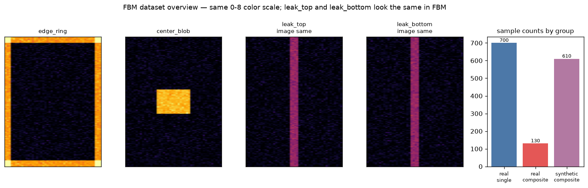
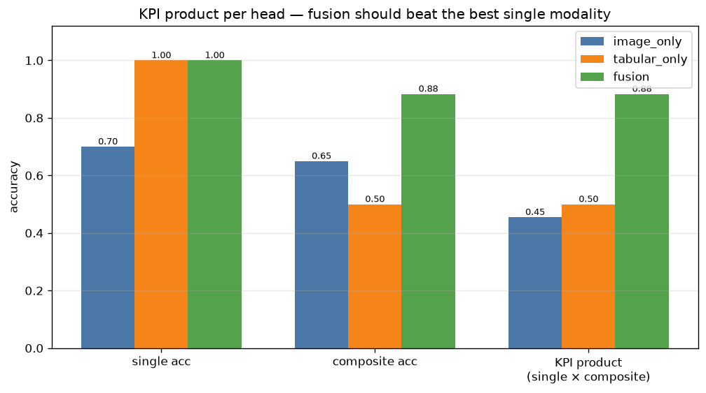
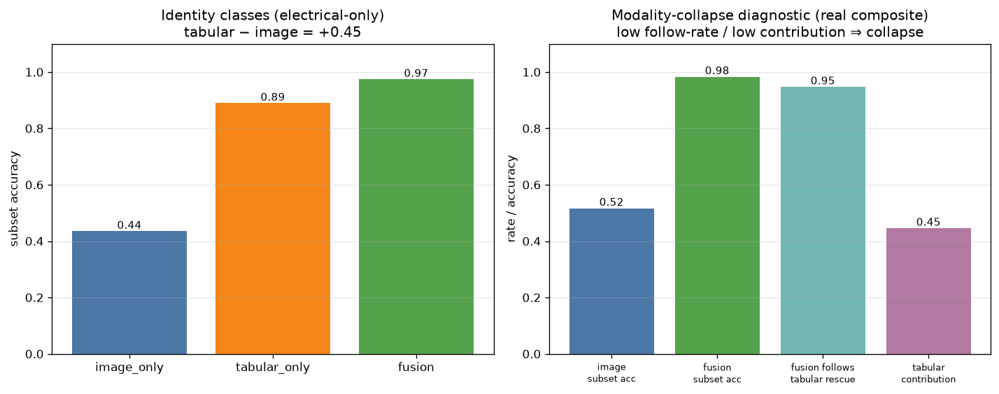

# 실험 한눈에 보기 — 컨셉과 평가 과정 (쉬운 설명)

> 이 문서는 코드를 몰라도 이 실험이 **무엇을 하려는 것이고**, **결과를 어떻게 채점하는지**를
> 이해할 수 있게 쉽게 정리한 글입니다.
> 더 깊은 내용은 [multimodal_fusion_guide.md](multimodal_fusion_guide.md)(설계),
> [fbm_domain_notes.md](fbm_domain_notes.md)(도메인 근거),
> [fusion_eval_quickstart.md](fusion_eval_quickstart.md)(실행법),
> [../reports/fusion_experiment_report.md](../reports/fusion_experiment_report.md)(전체 결과) 참고.

---

## 1. 무슨 문제를 푸나요?

반도체 칩 하나의 불량을 두 가지 정보로 분류합니다.

- **이미지(FBM)**: 칩 안에서 어디가 얼마나 fail 났는지 보여주는 그림. (128×46, 0~8 등급)
- **전기 측정값(tabular, MSR)**: 전기적으로 잰 수백 개의 측정 수치.

목표는 한 칩에 붙은 불량을 모두 맞히는 것입니다. 불량은 **하나만(단일)** 있을 수도 있고
**여러 개가 겹쳐(중첩)** 있을 수도 있습니다.

### 이 문제가 어려운 두 가지 이유

1. **이미지로는 똑같아 보이는데 전기로만 구분되는 불량이 있다.**
   예: 위쪽 누설 / 아래쪽 누설이 그림에서는 같은 세로줄로 보이지만, 전기값은 다릅니다.
   → 이미지만으로는 절대 못 가립니다. **전기값이 꼭 필요합니다.**

2. **이미지는 합성·증강이 되지만, 전기값은 합성이 안 됩니다.**
   중첩 불량 실제 데이터가 적어서 이미지는 합성으로 늘릴 수 있지만, 없는 전기값을 지어내면
   오히려 분류가 망가집니다. → **전기값은 가짜로 만들지 않습니다.**

---

## 2. 핵심 아이디어 (컨셉)

이미지와 전기값을 **합쳐서(fusion)** 봅니다. 단, 그냥 두 입력을 이어붙이는 게 아니라
다음 세 가지를 지킵니다.

- **머리(head)를 3개 둔다**: ① 이미지만 보는 머리, ② 전기값만 보는 머리, ③ 둘을 합친 머리.
  → 셋을 나란히 비교하면 "합치는 게 정말 이득인지" 바로 보입니다.
- **합성 이미지는 이미지 머리만 가르친다(loss masking)**: 합성 칩은 전기값이 없으니,
  전기·합친 머리는 **실측 칩으로만** 배웁니다.
- **모달리티 드롭아웃(modality dropout)**: 학습 중 일부러 전기값을 가려서, 합친 머리가
  이미지에만 기대지 않도록(= 한쪽으로 쏠리지 않도록) 만듭니다.

> 쉽게 말하면: "이미지는 풍부하니 이미지 머리는 실컷 키우되, 합치는 머리가 이미지에만
> 의존해서 전기값을 무시하는 일이 없도록 균형을 잡는다."

도메인 근거: FBM 불량 패턴(세로선=bit-line, 가로선=word-line, 덩어리=cluster, 흩어진 점=random)과
"grade 3 이상만 의미 있는 구조"라는 점은 RSVD 논문에서 가져왔습니다
([fbm_domain_notes.md](fbm_domain_notes.md)).

---

## 3. 데이터는 어떻게 생겼나요?



- 네 가지 불량 패턴: `edge_ring`(가장자리), `center_blob`(가운데 덩어리),
  `leak_top`/`leak_bottom`(위/아래 누설).
- `leak_top`과 `leak_bottom`은 **그림에서 똑같은 세로줄**로 보입니다 → 전기값으로만 구분.
- 칩은 세 묶음으로 평가합니다.
  - `real_single`: 실측, 단일 불량 (이미지 + 전기값 둘 다 있음)
  - `real_composite`: 실측, 중첩 불량 (둘 다 있음, **개수가 적음**)
  - `synthetic_composite`: 합성 중첩 (**이미지만**, 전기값 없음)

---

## 4. 결과를 어떻게 채점하나요? (평가 과정)

채점은 7단계로 봅니다. 각 단계가 "왜 필요한지"가 핵심입니다.

### ① 시험지를 3종류로 나눈다
위의 세 묶음(단일/중첩/합성)을 **따로** 채점합니다. 합성에는 전기값이 없으므로
전기·합친 머리는 합성 시험지를 **자동으로 건너뜁니다**(빈칸으로 둠).

### ② 채점은 "전부 맞아야 1점" (subset accuracy)
한 칩의 라벨을 **하나라도 틀리면 0점**입니다(부분 점수 없음). 엄격한 채점이라,
실제로 칩 단위로 맞췄는지를 정직하게 봅니다.

### ③ 최종 점수(KPI) = 단일 정확도 × 중첩 정확도
두 점수를 **곱합니다.** 한쪽만 잘하면 점수가 안 큽니다(한쪽이 0이면 곱도 0).
→ "단일도 중첩도 둘 다 잘해야 한다"는 뜻.

### ④ 세 머리를 나란히 비교한다
이미지-only / 전기-only / fusion 점수를 같이 봅니다.
**fusion이 둘보다 높아야** "합치는 게 의미 있다"는 증거가 됩니다.



### ⑤ fusion이 전기값을 진짜 쓰는지 검사한다 (제일 중요)
합친 머리가 겉으로만 좋아 보이고 속으로는 이미지만 따라갈 수 있습니다. 그래서 두 가지를 확인:

- **따라가기 비율(follow rate)**: 이미지가 틀렸지만 전기가 맞춘 문제를, fusion이 따라가 맞췄나?
- **전기 빼보기(ablation)**: 모델에서 전기 입력을 지웠을 때 점수가 얼마나 떨어지나?
  많이 떨어질수록 전기값을 실제로 쓰고 있다는 뜻.

### ⑥ "이미지로 안 되는 구간"만 따로 본다 (identity slice)
`leak_top`/`leak_bottom`처럼 그림이 똑같은 불량만 모아서, 전기·fusion이 이미지를 얼마나
앞서는지 봅니다. 여기서 전기가 앞서야 정상입니다.



### ⑦ 적은 데이터는 신뢰구간으로 본다
중첩 샘플이 적으면 정확도 숫자 하나만 믿으면 안 됩니다. **신뢰구간(Wilson CI)**과 표본 수를
함께 표기해, "표본이 적어 불확실함"을 드러냅니다.

---

## 5. 이번 결과 요약 (합성 데모 데이터)

| 머리 | 단일 정확도 | 중첩 정확도 | **KPI(곱)** |
|---|---:|---:|---:|
| 이미지 only | 0.722 | 0.583 | 0.421 |
| 전기 only | 1.000 | 0.550 | 0.550 |
| **fusion** | **0.989** | **0.967** | **0.956** |

- **fusion KPI 0.956 ≫ 단일 모달 최고 0.550** (차이 **+0.41**) → 합치는 게 확실히 이득.
- 이미지로 똑같은 구간: 이미지 **0.47** → 전기 **0.88** → fusion **0.97** (전기−이미지 **+0.41**).
- 전기 빼보기: fusion 정확도 0.983 → **0.396** (전기 기여 **+0.59**) → 이미지에만 의존하지 않음.
- 따라가기 비율 **0.88**(전기가 구한 17문제 중 15개를 fusion이 맞춤) → 쏠림(collapse) 없음.

> 주의: 이 수치는 **실데이터가 아니라 문제 구조를 흉내 낸 합성 데이터**의 결과입니다.
> 핵심은 "이 점수 달성"이 아니라 **평가 방법이 올바르게 작동함**을 보여주는 것입니다.

---

## 6. 직접 돌려보기

```bash
# 학습 → 평가 → 그림 생성 (numpy만, 약 1초)
PYTHONPATH=src python3 examples/run_fusion_experiment.py

# 예측 CSV만으로 평가 리포트 다시 만들기
PYTHONPATH=src python3 -m fbm_multimodal.fusion \
  --predictions reports/fusion_predictions.csv \
  --labels edge_ring,center_blob,leak_top,leak_bottom \
  --identity-labels leak_top,leak_bottom
```

실데이터로 바꾸려면 `examples/run_fusion_experiment.py`의 `generate_dataset()` 한 줄만 본인
데이터 로더로 교체하면 됩니다(컬럼 형식은 [fusion_eval_quickstart.md](fusion_eval_quickstart.md)).

---

## 7. 실데이터로 갈 때 꼭 기억할 것

- 이 점수는 깨끗한 합성 데이터 기준입니다. 실데이터에선 노이즈·라벨 오류·lot/wafer 차이로 낮아집니다.
- 평가는 무작위 분할만 보지 말고 **wafer/lot/시간 기준 분할**도 보세요(데이터 누수 방지).
- 중첩 데이터가 적으면 정확도 한 숫자가 아니라 **신뢰구간**을 함께 보세요.
- **전기값(tabular)은 가짜로 만들지 마세요.** 없으면 빈칸(NaN)으로 두면, 평가가 알아서 건너뜁니다.
- 팀 평가 땐 항상 세 가지를 같이 보세요: **전체 KPI / 어려운(identity) 구간 / fusion이 전기를 실제로 쓰는지**.
