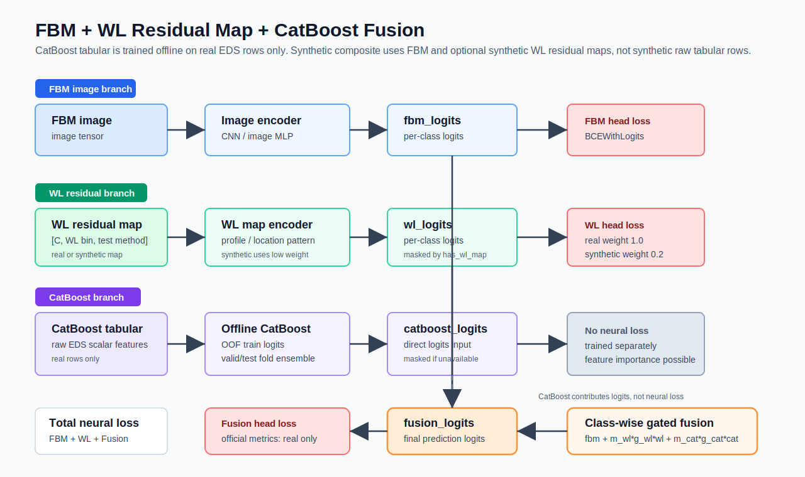
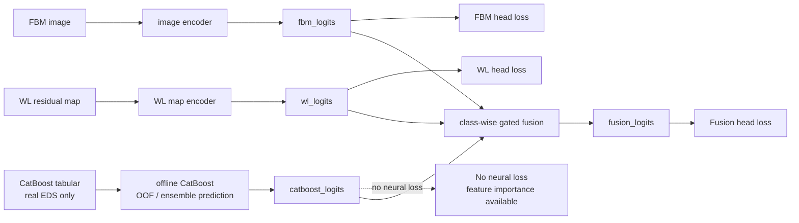

# Real Dataset Refactor Guide for Roo

이 문서는 현재 lightweight FBM fusion repo를 실제 데이터셋에 맞게 리팩토링하기 위한 작업 지침입니다. 목표는 기존 FBM fusion 구조를 유지하면서, 실제 보유 데이터인 **FBM image/label tensor dataset**과 **EDS tabular/label dataset**을 안전하게 결합하고, EDS test item별 wordline 위치 매핑을 통해 WL residual map branch를 사용할 수 있게 만드는 것입니다.

## 1. 목표 구조

현재 repo에는 다음 기능이 이미 있습니다.

- FBM image + tabular fusion baseline: `src/fbm_multimodal/fusion/`
- WL high-side residual tensorizer: `src/fbm_multimodal/wl_residual_map.py`
- Synthetic WL residual map composer: `src/fbm_multimodal/synthetic_wl_map.py`
- CatBoost OOF logit generator: `src/fbm_multimodal/training/train_catboost_oof.py`
- Pseudo-label pairwise top-K scaffold: `src/fbm_multimodal/pseudo_labeling/pairwise_topk.py`
- Fusion evaluation/leakage checks: `src/fbm_multimodal/fusion/fusion_eval.py`

Roo가 해야 할 핵심 작업은 **실제 데이터 loader와 변환 파이프라인을 이 repo의 계약에 맞추는 것**입니다. 모델을 먼저 키우지 말고, 데이터 계약과 leakage check를 먼저 고정합니다.

## 2. 표준 폴더 배치

실제 데이터는 커밋하지 않는 것을 권장합니다. 아래 구조를 로컬 표준으로 사용합니다.

```text
data/
  raw/
    fbm_tensor/
      fbm_images.npy
      fbm_manifest.csv
      label_map.json
    eds_tabular/
      eds_tabular.parquet
      eds_tabular.csv
  metadata/
    eds_test_item_wordline_map.csv
    split_manifest.csv
  interim/
    wl_measurements.parquet
    wl_residual_tensorizer.json
    wl_maps.npz
    fusion_manifest.parquet
outputs/
  catboost_logits/
  real_fusion/
reports/
  real_fusion/
notebooks/
  model_architecture_and_eval_briefing.ipynb
```

권장 우선순위:

1. 원본 파일은 `data/raw/` 아래에 둡니다.
2. 사람이 작성/검수하는 metadata는 `data/metadata/` 아래에 둡니다.
3. 코드가 생성하는 변환 결과는 `data/interim/` 아래에 둡니다.
4. 학습 산출물은 `outputs/`, 리포트는 `reports/` 아래에 둡니다.

## 3. Dataset Contract

### 3.1 FBM Tensor Dataset

권장 파일:

```text
data/raw/fbm_tensor/fbm_images.npy
data/raw/fbm_tensor/fbm_manifest.csv
data/raw/fbm_tensor/label_map.json
```

`fbm_images.npy`:

```text
shape: [N, H, W] 또는 [N, C, H, W]
dtype: float32 권장
value: FBM grade/intensity. 현재 예제는 0..8 grade를 가정합니다.
```

`fbm_manifest.csv` 필수 column:

```csv
row_idx,sample_id,split,eval_group,label_ERS_0,label_ERS_1,label_ERS_2
0,CHIP_000001,train,real_single,1,0,0
1,CHIP_000002,train,real_composite,1,1,0
2,CHIP_000003,test,real_single,0,0,1
```

Column 규칙:

- `row_idx`: `fbm_images.npy`의 첫 번째 축 index와 정확히 매칭합니다.
- `sample_id`: EDS tabular dataset과 join할 canonical ID입니다.
- `split`: `train`, `valid`, `test` 중 하나입니다.
- `eval_group`: `real_single`, `real_composite`, `synthetic_composite` 중 하나입니다.
- label column은 EDS tabular label과 같은 이름을 사용합니다.

`label_map.json` 예시:

```json
{
  "label_columns": ["label_ERS_0", "label_ERS_1", "label_ERS_2"],
  "label_names": ["ERS_0", "ERS_1", "ERS_2"]
}
```

### 3.2 EDS Tabular Dataset

권장 파일:

```text
data/raw/eds_tabular/eds_tabular.parquet
```

CSV만 가능하면 아래 파일을 사용해도 됩니다.

```text
data/raw/eds_tabular/eds_tabular.csv
```

Wide format을 표준으로 둡니다.

```csv
sample_id,split,eval_group,label_ERS_0,label_ERS_1,EDS_RD_WL000,EDS_RD_WL001,EDS_PGM_WL000
CHIP_000001,train,real_single,1,0,12.4,13.1,8.0
CHIP_000002,valid,real_composite,1,1,18.5,20.2,9.4
```

필수 column:

- `sample_id`
- `split`
- `eval_group`
- label columns
- EDS feature columns

권장 규칙:

- FBM manifest와 EDS tabular는 `sample_id` 기준으로 join합니다.
- FBM에는 있지만 EDS가 없는 sample은 `has_wl_map=0`, `has_catboost_logits=0`으로 처리합니다.
- EDS에는 있지만 FBM이 없는 sample은 fusion training에서는 제외하거나 pseudo-label 후보로만 보관합니다. 현재 기본 pseudo-labeling은 off입니다.
- Synthetic sample은 CatBoost 학습에서 제외합니다.

## 4. EDS Test Item to Wordline Mapping Table

작성 위치:

```text
data/metadata/eds_test_item_wordline_map.csv
```

원칙은 **EDS tabular feature column 1개당 mapping row 1개**입니다. `feature_name`은 EDS tabular 파일의 column명과 정확히 같아야 합니다.

### 4.1 권장 Schema

```csv
feature_name,eds_step,eds_item,wordline_position,value_direction,include_in_catboost,notes
EDS_RD_WL000,READ,RD_LEAK,0,high_bad,1,single WL feature
EDS_RD_WL001,READ,RD_LEAK,1,high_bad,1,single WL feature
EDS_PGM_WL000,PROGRAM,PGM_MARGIN,0,high_bad,1,
EDS_GLOBAL_IDDQ,IDDQ,IDDQ_TOTAL,,high_bad,1,WL 위치 없는 global scalar
```

Column 정의:

| column | required | 설명 |
|---|---:|---|
| `feature_name` | yes | EDS tabular feature column과 정확히 같은 이름 |
| `eds_step` | yes | WL residual map의 T축이 되는 EDS step. 예: `READ`, `PROGRAM`, `ERASE`, `IDDQ` |
| `eds_item` | yes | EDS test item 원명 또는 엔지니어가 쓰는 item name |
| `wordline_position` | yes | 단일 WL이면 integer 또는 `WL000`. WL 위치가 없는 global scalar이면 blank |
| `value_direction` | no | 기본 `high_bad`. 낮을수록 나쁜 margin류 feature는 `low_bad` |
| `include_in_catboost` | no | 기본 `1`. CatBoost에서 제외할 feature만 `0` |
| `notes` | no | 검수 메모 |

### 4.2 Mapping 작성 규칙

- `include_in_wl_map`은 사람이 작성하지 않아도 됩니다. `wordline_position`이 있으면 자동 `1`, 비어 있으면 자동 `0`입니다.
- `wordline_position`은 integer 또는 `WL000` 같은 문자열이어도 됩니다. 내부 parser가 둘 다 지원합니다.
- `value_direction=low_bad`이면 WL residual 변환 전에 값을 `-raw_value`로 뒤집어 high-side residual 정의에 맞춥니다.
- WL 위치가 없는 global scalar feature는 WL measurements에 들어가지 않지만, `include_in_catboost=1`이면 CatBoost scalar feature로 남습니다.
- label column은 mapping table에 넣지 않습니다.
- ID, lot, wafer, split 같은 metadata column도 mapping table에 넣지 않습니다.

## 5. Required Generated Tables

### 5.1 Long-form WL Measurements

Roo는 wide EDS tabular와 mapping table을 이용해 다음 파일을 생성합니다.

```text
data/interim/wl_measurements.parquet
```

Schema:

```csv
sample_id,split,eval_group,test_method,wordline,value,feature_name,test_item,is_synthetic
CHIP_000001,train,real_single,read,0,12.4,EDS_RD_WL000,RD_LEAK,0
CHIP_000001,train,real_single,read,1,13.1,EDS_RD_WL001,RD_LEAK,0
```

이 table이 `WLResidualMapTensorizer.fit()`과 `transform()`의 입력입니다.

### 5.2 Fusion Manifest

Roo는 FBM manifest와 EDS availability를 join해서 다음 파일을 생성합니다.

```text
data/interim/fusion_manifest.parquet
```

권장 schema:

```csv
sample_id,fbm_row_idx,split,eval_group,has_fbm_image,has_eds_tabular,has_wl_map,has_catboost_logits,label_ERS_0,label_ERS_1
CHIP_000001,0,train,real_single,1,1,1,1,1,0
```

이 manifest는 누락 modality를 mask로 처리하기 위한 source of truth입니다.

## 6. 바로 실행 가능한 Smoke Test Workflow

### Step 1. FBM tensor dataset 로드 검증

제공 모듈:

```python
from fbm_multimodal.fusion.real_data import load_fbm_tensor_dataset

images, fbm_manifest, label_map = load_fbm_tensor_dataset("data/raw/fbm_tensor")
label_columns = label_map["label_columns"]
```

검증되는 항목:

- `fbm_images.npy`, `fbm_manifest.csv`, `label_map.json` 존재 여부
- `row_idx`가 image tensor 첫 축 범위 안에 있는지
- `sample_id` 중복 여부
- `split` 값이 `train/valid/test` 중 하나인지
- label columns가 manifest에 존재하는지

### Step 2. EDS tabular + mapping 검증

CLI:

```bash
PYTHONPATH=src python3 -m fbm_multimodal.cli validate-eds-map \
  --eds data/raw/eds_tabular/eds_tabular.csv \
  --mapping data/metadata/eds_test_item_wordline_map.csv \
  --label-columns label_ERS_0,label_ERS_1,label_ERS_2
```

출력 예시:

```
{
  "mapped_features": 417,
  "wl_map_features": 201,
  "catboost_features": 417,
  "low_bad_features": 12,
  "missing_features": []
}
```

제공 모듈:

```python
from fbm_multimodal.eds_mapping import validate_eds_wordline_map, catboost_feature_columns
```

검증되는 항목:

- mapping의 `feature_name`이 실제 EDS column에 존재하는지
- `wordline_position`이 있는 feature만 WL map 후보가 되는지
- `include_in_catboost=0`인 feature가 CatBoost 후보에서 제외되는지
- `low_bad` / `high_bad` 값 방향이 유효한지

### Step 3. Wide EDS -> long-form WL measurements 생성

CLI:

```bash
PYTHONPATH=src python3 -m fbm_multimodal.cli build-wl-measurements \
  --eds data/raw/eds_tabular/eds_tabular.csv \
  --mapping data/metadata/eds_test_item_wordline_map.csv \
  --output data/interim/wl_measurements.csv
```

출력 schema:

```csv
sample_id,split,eval_group,test_method,wordline,value,feature_name,test_item,is_synthetic
CHIP_000001,train,real_single,READ,0,12.4,EDS_RD_WL000,RD_LEAK,False
```

제공 모듈:

```python
from fbm_multimodal.eds_mapping import wide_eds_to_wl_measurements
```

### Step 4. Fusion manifest 생성

제공 모듈:

```python
from fbm_multimodal.fusion.real_data import load_eds_tabular, build_fusion_manifest

eds = load_eds_tabular("data/raw/eds_tabular/eds_tabular.csv")
fusion_manifest = build_fusion_manifest(
    fbm_manifest,
    eds,
    label_columns=label_columns,
)
```

생성되는 기본 mask:

```text
has_fbm_image
has_eds_tabular
has_wl_map
has_catboost_logits
```

### Step 5. WL residual cache 생성

현재 제공 모듈:

```python
from fbm_multimodal.wl_residual_map import WLResidualMapTensorizer

measurements = pd.read_csv("data/interim/wl_measurements.csv")
tensorizer = WLResidualMapTensorizer(num_wl_bins=20, clip_max=10.0)
tensorizer.fit(measurements)
tensorizer.save("data/interim/wl_residual_tensorizer.json")
wl_maps = tensorizer.transform(measurements)
```

필수 정책:

- `fit()`은 train real sample만 사용합니다.
- valid/test는 transform만 합니다.
- synthetic sample이 있으면 baseline fit에서 제외합니다.

### Step 6. CatBoost OOF logit 생성

기존 CLI:

```bash
PYTHONPATH=src python3 -m fbm_multimodal.training.train_catboost_oof \
  --features data/raw/eds_tabular/eds_tabular.csv \
  --labels data/raw/eds_tabular/eds_tabular.csv \
  --label-columns label_ERS_0,label_ERS_1,label_ERS_2 \
  --output-dir outputs/catboost_logits \
  --sample-id-column sample_id \
  --split-column split \
  --synthetic-column is_synthetic \
  --num-folds 5
```

Train sample prediction은 반드시 OOF여야 합니다. Synthetic sample은 CatBoost training에서 제외됩니다.

### Step 7. Real fusion training entrypoint

권장 신규 파일:

```text
examples/run_real_fusion_experiment.py
```

실제 학습 entrypoint는 데이터 컬럼명이 확정된 뒤 아래 순서로 얇게 만들면 됩니다.

1. FBM tensor + manifest load
2. EDS tabular load
3. fusion manifest build
4. WL map cache load
5. CatBoost logits load
6. 기존 `FusionMLP` 또는 `ClasswiseGatedResidualFusion`에 맞는 input 구성
7. `evaluate_fusion()`으로 real-only official metric 생성
8. `run_leakage_checks()` 결과 저장

## 7. Leakage Guardrails

반드시 지켜야 할 조건:

- WL median/IQR baseline은 train real row만 사용합니다.
- CatBoost train logits는 OOF만 사용합니다.
- synthetic sample은 CatBoost training에서 제외합니다.
- validation/test metric에는 synthetic sample을 official metric으로 넣지 않습니다.
- pseudo-labeling은 기본 off입니다.
- pseudo-labeling을 켤 때도 global top-K가 아니라 pairwise top-K만 사용합니다.
- split은 `sample_id` 단위로 고정하고, parent sample과 synthetic child sample이 서로 다른 split에 들어가지 않도록 합니다.

## 8. Team Briefing Summary

팀 브리핑용 모델 아키텍처 이미지는 아래 파일을 사용합니다.



Mermaid로 빠르게 공유해야 할 때는 아래 블록을 사용할 수 있습니다.



팀에 설명할 때는 다음 메시지로 요약하면 됩니다.

```text
이번 리팩토링은 raw tabular를 합성하지 않습니다.
FBM image는 기존대로 사용하고, EDS raw measurement는 두 갈래로 사용합니다.

1. EDS scalar feature는 CatBoost one-vs-rest OOF logit으로 변환해서 fusion에 넣습니다.
2. WL 위치가 있는 EDS item은 train real 기준 median/IQR 대비 high-side residual map으로 바꿔 WL branch에 넣습니다.
3. Synthetic composite에는 raw tabular row를 만들지 않고, parent residual map의 max + union mask + source_count channel만 낮은 weight로 사용합니다.
4. 공식 평가는 real_single / real_composite만 보고, synthetic은 auxiliary diagnostic으로만 봅니다.
```

## 9. Roo Handoff Prompt

Roo에 아래 프롬프트를 그대로 넘겨도 됩니다.

```markdown
# Task: Refactor FBM Multi-Modal Fusion Repo for Real FBM Tensor + EDS Tabular Dataset

Use `docs/real_dataset_roo_refactor_guide.md` as the source of truth.

Inputs expected locally:
- `data/raw/fbm_tensor/fbm_images.npy`
- `data/raw/fbm_tensor/fbm_manifest.csv`
- `data/raw/fbm_tensor/label_map.json`
- `data/raw/eds_tabular/eds_tabular.parquet` or `.csv`
- `data/metadata/eds_test_item_wordline_map.csv`

Use the existing tested modules first:
1. Use `fbm_multimodal.fusion.real_data.load_fbm_tensor_dataset` to load FBM tensors.
2. Use `fbm_multimodal.fusion.real_data.load_eds_tabular` to load EDS tabular data.
3. Use `fbm_multimodal.cli validate-eds-map` to validate `eds_test_item_wordline_map.csv`.
4. Use `fbm_multimodal.cli build-wl-measurements` to create `data/interim/wl_measurements.csv`.
5. Use `WLResidualMapTensorizer` to build the train-real-only residual baseline/cache.
6. Use `fbm_multimodal.training.train_catboost_oof` for real-train-only OOF CatBoost logits.
7. Add only the thin project-specific `examples/run_real_fusion_experiment.py` wrapper after real column names are confirmed.
8. Keep pseudo-labeling disabled by default and evaluate official metrics on real_single / real_composite only.

Do not generate synthetic raw tabular rows. Do not fit WL baselines on validation/test.
Add tests for any new project-specific wrapper or column-name adaptation.
```

## 10. Acceptance Criteria

- 실제 FBM tensor와 manifest가 로드됩니다.
- 실제 EDS tabular와 label이 로드됩니다.
- EDS feature -> WL mapping validator가 동작합니다.
- `wl_measurements.parquet`가 생성됩니다.
- WL residual baseline이 train real sample만 사용했다는 evidence가 남습니다.
- CatBoost train logits가 OOF로 생성됩니다.
- Fusion manifest가 modality mask를 포함합니다.
- 공식 metric은 real sample만 포함합니다.
- 팀 briefing notebook이 열리고 top-to-bottom 실행됩니다.
