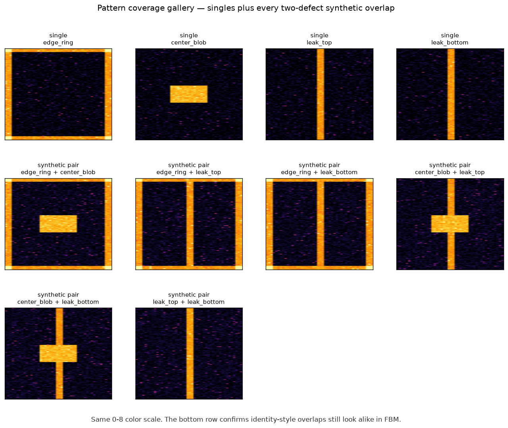
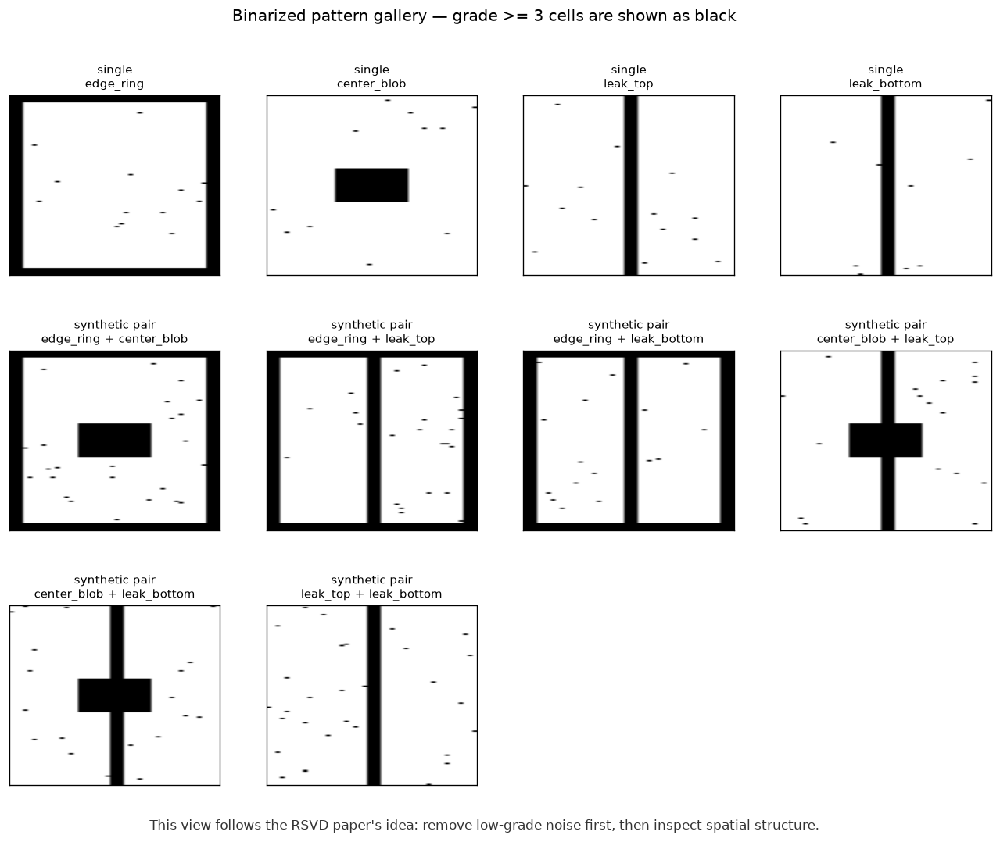
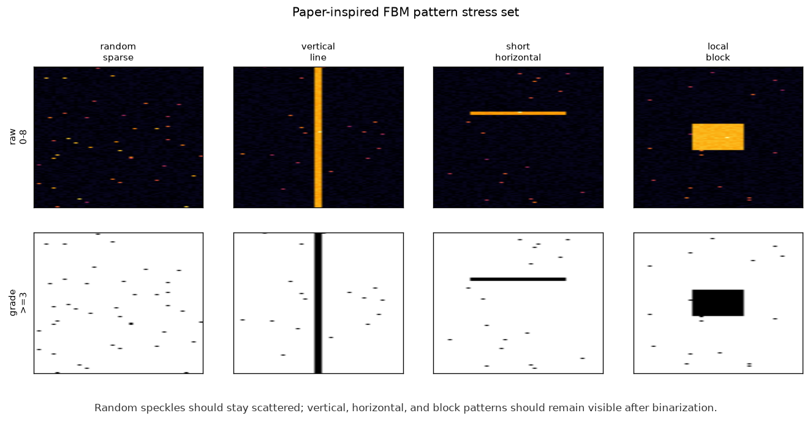
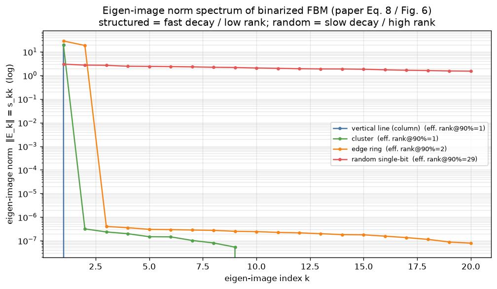

# Image + Tabular Fusion 실험 리포트

> 재현 명령어: `PYTHONPATH=src python3 examples/run_fusion_experiment.py`
> 설계 배경: [../docs/multimodal_fusion_guide.md](../docs/multimodal_fusion_guide.md)
> 평가기 사용법: [../docs/fusion_eval_quickstart.md](../docs/fusion_eval_quickstart.md)

## 한 줄 결론

이번 데모 실험에서는 **image와 tabular를 함께 쓰는 fusion이 가장 좋았습니다.**

- 단일 불량 acc: `0.989`
- 중첩 불량 acc: `0.967`
- KPI product: `0.956`

목표였던 `single >= 0.8`, `composite >= 0.6`, `single * composite >= 0.65`를 모두 넘었습니다.

다만 이 수치는 실데이터가 아니라 **실제 문제 구조를 흉내 낸 합성 데이터**에서 나온 결과입니다.
따라서 이 리포트의 핵심은 "실제 KPI 달성 확정"이 아니라, **어떤 방식으로 평가하면 되는지**와
**image만으로 안 풀리는 케이스를 tabular가 어떻게 살리는지**를 보여주는 것입니다.

## 실험에서 확인한 패턴

데이터는 `128x46` FBM image를 사용하고, intensity는 `0~8` grade로 표현했습니다.


패턴은 네 가지로 구성했습니다.

- `edge_ring`: 가장자리 쪽이 강한 패턴
- `center_blob`: 가운데 영역이 강한 패턴
- `leak_top`, `leak_bottom`: FBM image에서는 거의 같은 세로 stripe로 보이는 패턴

특히 `leak_top`과 `leak_bottom`은 **이미지만 보면 구분하기 어렵게** 만들었습니다.
두 클래스는 tabular 전기값에서 top/bottom 영역 차이가 나야 구분됩니다.

아래 그림은 단일 4종과 가능한 2-label 중첩 6종을 모두 보여줍니다.
이번 보완에서 generator가 작은 데이터셋에서도 이 6개 중첩 조합을 빠뜨리지 않도록 수정했습니다.



## 논문에서 반영한 도메인 지식

`papers/RSVD.pdf`의 FBM 예시를 보면 낮은 grade를 모두 패턴으로 보지 않고,
일정 수준 이상의 grade만 남긴 이진화 화면으로 공간 패턴을 먼저 확인합니다.
이번 보완에서는 그 관점을 실험 리포트에 추가했습니다.

아래 그림은 현재 실험 패턴을 **grade 3 이상만 검정색으로 남긴 화면**입니다.
낮은 grade noise를 걷어내면 edge, center, stripe 구조가 더 단순하게 보입니다.
반대로 `leak_top`과 `leak_bottom`은 이렇게 봐도 여전히 비슷합니다.
즉, 이 유형은 이미지 전처리를 바꾸는 것만으로는 충분하지 않고 tabular 전기값이 필요합니다.



논문에는 랜덤하게 흩어진 점, 길게 이어진 세로선, 짧은 가로선, 국소 block 같은 FBM 예시가 나옵니다.
이를 팀원이 쉽게 비교할 수 있도록 별도의 stress gallery도 추가했습니다.



또한 논문(Eq. 8 / Fig. 6)은 이진화 FBM을 (R)SVD로 분해한 **eigen-image norm**으로 패턴을 판별합니다.
구조 패턴(세로선·block·edge)은 소수의 eigen-image에 에너지가 몰려 norm이 빠르게 줄고(low-rank),
랜덤 single-bit은 많은 eigen-image로 퍼져 천천히 줄어듭니다(high-rank). 이 **eigen-image norm 16개를
fusion 모델의 image feature로 실제 추가**했습니다(원본 grade 화면 + 이진화 화면과 함께).



주의할 점은 논문의 `single-bit / non-single-bit` 구분이 여기서 말하는
`단일 label / 중첩 label`과 같은 뜻은 아니라는 것입니다.
논문은 FBM 안에 공간 패턴이 있는지 없는지를 보는 쪽에 가깝고,
우리 실험은 여러 불량 원인이 동시에 붙은 multi-label 분류를 다룹니다.
그래서 논문의 single/non-single 분류기를 라벨로 그대로 쓰지는 않되,
**이진화 + eigen-image norm feature는 모델에 실제 반영**하고,
**고강도 grade 진단 그림**과 **패턴 스트레스 확인**도 함께 붙였습니다.

## 왜 fusion이 필요한가

image-only와 tabular-only는 각각 강점이 다릅니다.

- image-only는 edge, center 같은 공간 패턴을 잘 봅니다.
- tabular-only는 `leak_top`, `leak_bottom`처럼 이미지가 비슷한 클래스를 잘 나눕니다.
- fusion은 둘의 장점을 같이 쓰기 때문에 중첩 불량에서 가장 안정적입니다.

## 성능 결과


| head | single acc | composite acc | KPI product |
|---|---:|---:|---:|
| image_only | 0.722 | 0.583 | 0.421 |
| tabular_only | 1.000 | 0.550 | 0.550 |
| fusion | **0.989** | **0.967** | **0.956** |

해석은 단순합니다.

- image-only는 중첩에서 `0.583`으로 낮습니다.
- tabular-only는 단일은 완벽하지만 중첩에서 `0.550`에 머뭅니다.
- fusion은 단일 `0.989`, 중첩 `0.967`로 둘 다 높습니다.
- best unimodal KPI가 `0.550`인데 fusion KPI는 `0.956`입니다. 차이는 `+0.406`입니다.

## image로만 안 되는 영역


`leak_top`, `leak_bottom`처럼 이미지가 비슷한 클래스만 따로 보면 다음과 같습니다.

- image-only acc: `0.468`
- tabular-only acc: `0.879`
- fusion acc: `0.972`
- tabular가 image보다 `+0.411` 높음

즉, 이 유형은 synthetic image를 많이 늘려도 근본적으로 해결하기 어렵습니다.
전기값이 들어와야 분류가 됩니다.

## fusion이 tabular를 실제로 쓰는지 확인

fusion이 겉으로만 좋아 보이고 실제로는 image만 따라가면 위험합니다.
그래서 두 가지 확인을 했습니다.

1. real composite에서 image-only는 틀렸지만 tabular-only는 맞춘 샘플을 찾았습니다.
   이런 샘플 17개 중 fusion이 15개를 맞췄습니다. follow rate는 `0.882`입니다.
2. 모델 입력에서 tabular를 지우는 ablation을 했습니다.
   fusion acc가 `0.983`에서 `0.396`으로 내려갔습니다. tabular 기여는 `+0.587`입니다.

따라서 이번 실험에서는 fusion이 tabular를 무시하는 상태가 아닙니다.

## 실무 적용 시 주의점

- 이 결과는 합성 데이터 기반입니다. 실데이터에서는 noise, label 오류, lot/wafer 차이 때문에 수치가 낮아질 수 있습니다.
- 실데이터 평가는 random split만 보지 말고 wafer/lot/time 기준 split도 봐야 합니다.
- 실제 중첩 불량 support가 작으면 subset acc 하나만 보지 말고 confidence interval도 같이 봐야 합니다.
- synthetic tabular는 만들지 않는 편이 안전합니다. 없는 전기값을 임의로 만들면 오히려 tabular 기준이 흔들릴 수 있습니다.
- 팀 평가에서는 항상 세 가지를 같이 보세요: 전체 KPI, image로 비슷한 클래스 slice, fusion이 tabular를 실제로 쓰는지.

## 재현

```bash
PYTHONPATH=src python3 examples/run_fusion_experiment.py
PYTHONPATH=src python3 -m pytest tests/test_fusion_model.py tests/test_fusion_eval.py -q
```

주요 산출물:

- `reports/figures/01_dataset_overview.png`
- `reports/figures/06_pattern_gallery.png`
- `reports/figures/07_binarized_pattern_gallery.png`
- `reports/figures/08_paper_pattern_stress_gallery.png`
- `reports/figures/09_eigenimage_spectrum.png`
- `reports/figures/04_kpi_product.png`
- `reports/figures/05_identity_and_collapse.png`
- `reports/fusion_predictions.csv`
- `reports/fusion_report.md`
- `reports/fusion_report.json`
- `reports/training_history.csv`
