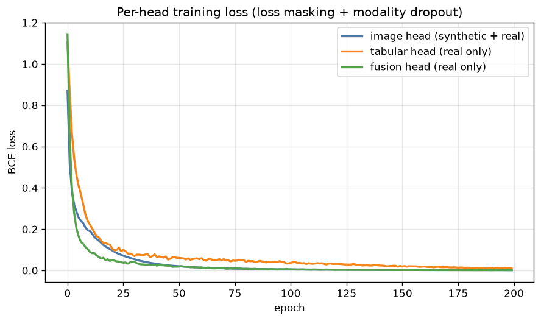
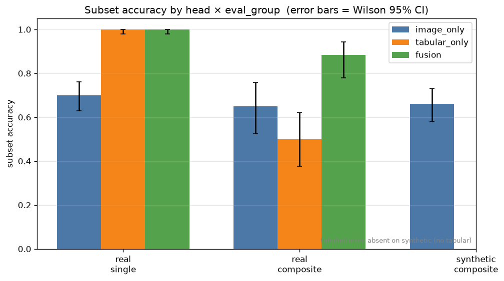

# Fusion Experiment Report — Image + Tabular under Modality Asymmetry

> 자동 생성 실험 리포트. 재생성: `PYTHONPATH=src python3 examples/run_fusion_experiment.py`
> 배경/설계: [../docs/multimodal_fusion_guide.md](../docs/multimodal_fusion_guide.md) ·
> 평가기 사용법: [../docs/fusion_eval_quickstart.md](../docs/fusion_eval_quickstart.md)

## 질문

> "이미지는 합성·증강이 가능하지만 tabular(전기 MSR)는 합성이 불가능한데, image와 tabular를
> fusion해서 학습이 되는가?"

이 실험은 **된다**는 것을, 그리고 **어떤 조건에서 되는지**를 end-to-end로 보입니다.
모델은 numpy만으로 구현된 3-head fusion 네트워크이며, 핵심은 모델 크기가 아니라
**학습 스킴**입니다 — loss masking + modality dropout.

## 데이터셋 (합성 stand-in)

실데이터가 없으므로, 실제 문제 구조를 그대로 본뜬 합성 데이터로 파이프라인을 돌립니다.
팀은 이 generator만 실데이터 loader로 교체하면 됩니다.


- `edge_ring`, `center_blob` — **이미지로 구분 가능**한 공간 클래스.
- `leak_top`, `leak_bottom` — **이미지에서는 완전히 동일**(가운데 세로 stripe)하고 **전기
  특성으로만 구분**되는 "정체성 클래스". synthetic 이미지로는 절대 가르칠 수 없는 케이스.
- `real_single` / `real_composite`(희소) 는 tabular 보유, `synthetic_composite` 는 두 단일
  불량 이미지를 `np.maximum`으로 합성 → **tabular 없음**(전기값은 합성 불가).

## 학습 스킴



- **Loss masking** — synthetic(이미지만) 샘플은 **image head만** 학습. real 샘플만
  tabular/fusion head를 학습 (plan.md: "synthetic image는 image branch 학습에만 사용").
- **Modality dropout** — 학습 중 real 샘플의 tabular 임베딩을 확률 0.3으로 학습된 null
  벡터로 대체 → fusion이 (synthetic으로 풍부한) image 쪽으로 collapse하지 못하게 강제.
- 세 head(image-only / tabular-only / fusion)를 동시에 출력.

## 결과

### head × eval_group subset accuracy



tabular/fusion head는 `synthetic_composite`에 막대가 없습니다 — 그 그룹엔 tabular가 없어
평가에서 자동 제외되기 때문입니다(모달리티 비대칭이 평가에 그대로 반영됨).

### KPI product (single × composite)


| head | single acc | composite acc | **KPI product** |
|---|---|---|---|
| image_only | 0.70 | 0.65 | 0.45 |
| tabular_only | 1.00 | 0.50 | 0.50 |
| **fusion** | **1.00** | **0.88** | **0.88** |

- **fusion KPI 0.88 ≫ best unimodal 0.50** (gain **+0.38**).
- tabular는 single을 완벽히 맞추지만 composite에서 약하고, image는 정체성 클래스에서 약하다.
  fusion이 둘을 결합해 양쪽을 모두 끌어올린다.

### 정체성 클래스 & collapse 진단


- **정체성 슬라이스**: image 0.48 → tabular 0.86 → fusion 0.95. `tabular − image = +0.38`.
  이미지로 못 가르는 클래스를 tabular가 살리고 fusion이 그걸 가져간다.
- **collapse 진단(real composite)**: fusion이 image보다 +0.23 높고, tabular가 구한 케이스의
  67%를 fusion이 따라감(follow-rate 0.67). **경고 없음** = collapse 아님.
- **진짜 ablation**(모델에서 tabular를 null로 치환): subset acc 0.97 → 0.58,
  **tabular 기여 +0.39**. fusion이 tabular를 실제로 쓰고 있음을 증명.

## 결론

1. **모달리티 비대칭에서도 fusion 학습이 된다** — 단, 순진한 concat이 아니라 loss masking으로
   각 샘플을 valid한 head로만 흘리고, modality dropout으로 collapse를 막아야 한다.
2. **가짜 tabular를 만들지 않는 것이 옳다** — 합성은 image branch만 키우고, tabular/fusion은
   real로 학습하면 충분히 fusion 이득이 나온다.
3. **정체성 클래스는 tabular가 필수** — 이미지 합성으로는 영원히 못 푸는 영역이며, 여기서
   fusion의 가치가 가장 크다. 그래서 별도 슬라이스로 항상 추적한다.

## 한계 / 실데이터 전 체크

- 인코더는 numpy MLP(단순화)다. 실전에선 torch CNN/transformer로 교체하되 3-head /
  loss-masking 인터페이스는 그대로 둔다.
- 데이터는 합성이라 신호가 깨끗하다. 실데이터에선 측정 노이즈·라벨 노이즈로 수치가 낮아진다.
- split은 데모라 random이다. **실데이터에선 반드시 wafer/lot group split**으로 누수를 막을 것
  (plan 리뷰 P0). composite support가 작으면 Wilson CI를 함께 본다.

## 재현

```bash
PYTHONPATH=src python3 examples/run_fusion_experiment.py
PYTHONPATH=src python3 -m pytest tests/test_fusion_model.py tests/test_fusion_eval.py -q
```

산출물: `reports/figures/*.png`, `reports/fusion_predictions.csv`,
`reports/fusion_report.{md,json}`, `reports/training_history.csv`.
